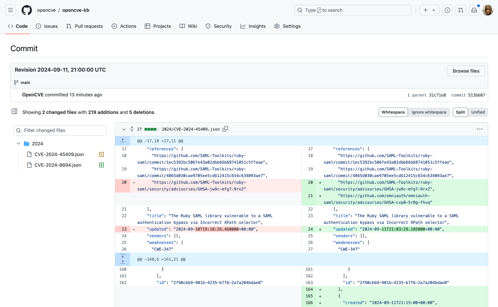
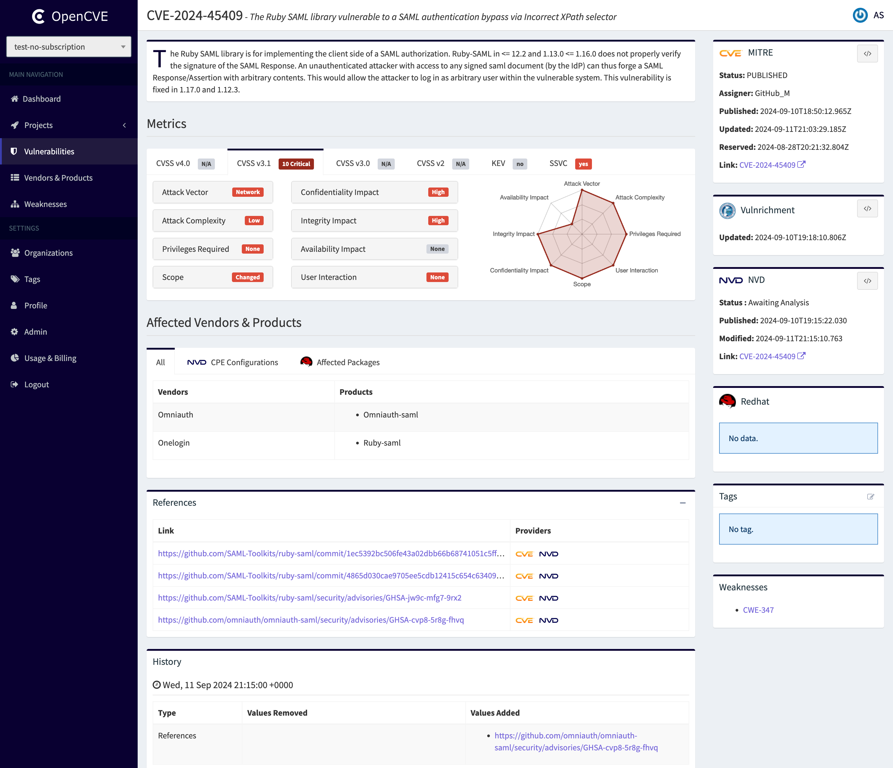
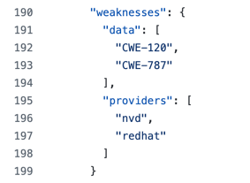

# Knowledge Base (KB)

## Overview

The Knowledge Base (KB) is at the core of how OpenCVE operates. It serves as a centralized repository of the CVEs data, shared by all OpenCVE instances, including the [SaaS version](https://www.opencve.io).

The KB is hosted as a public GitHub repository at [https://github.com/opencve/opencve-kb](https://github.com/opencve/opencve-kb), so everyone can access it freely.

{.center style="width:75%"}

It is populated automatically by scripts that are not part of the public OpenCVE codebase. These scripts continuously pull data from the various providers, process it, and store the aggregated result in the KB.

Then all OpenCVE instances fetch this KB to populate their own database. In the end, when you browse the web application, you browse the KB:

{.center style="width:75%"}

## Objective

OpenCVE fetches CVE data from the following trusted providers:

- the [cvelistv5 repository](https://github.com/CVEProject/cvelistV5) provided by **MITRE**
- the [vulnrichment](https://github.com/cisagov/vulnrichment) provided by **CISA**
- the [vulnerability API](https://nvd.nist.gov/developers/vulnerabilities) provided by **NVD**
- the [security data API](https://docs.redhat.com/en/documentation/red_hat_security_data_api/1.0/html/red_hat_security_data_api/index) provided by **Redhat**

By cross-referencing data from these providers, OpenCVE ensures that users receive the most accurate and timely information, even if one provider is delayed or unavailable.

Each provider has its own format, so the goal of the KB is to aggregate all the information into a single and common format understandable by automated tools, including OpenCVE.

## Aggregation Rules

### Prioritized Fields

When aggregating data from multiple providers, it's possible for certain fields, such as CVSS scores, to have different values depending on the provider. For example, one provider might assign a CVSS 3.1 score of 8.7 to a CVE, while another might assign a score of 9.5.

In such cases, OpenCVE follows a predefined priority order to determine which value to display. This ensures consistency across the platform and prevents conflicting information.

For instance, if found in several providers, the CVSS 3.1 score is prioritized in this order:

1. first **MITRE**,
2. then **Vulnrichment**,
3. then **NVD**,
4. finally **RedHat**.

This means that if MITRE provides a CVSS 3.1 value, OpenCVE will prioritize it over the others. If MITRE does not provide that field, OpenCVE will look to the Vulnrichment, and so on.

By following this priority order, OpenCVE ensures that the most reliable and authoritative source is used whenever possible, while also cross-checking data from other sources to offer the most complete view of a vulnerability.

Here is the list of prioritized fields:

| Field                            | Priority                            |
|----------------------------------|-------------------------------------|
| description                      | Mitre > Vulnrichment > NVD > Redhat |
| created                          | Oldest date of all providers        |
| updated                          | Most recent date of all providers   |
| title                            | Mitre > Vulnrichment > NVD > Redhat |
| cvss (v2.0 / v3.0 / v3.1 / v4.0) | Mitre > Vulnrichment > NVD > Redhat |
| ssvc                             | Vulnrichment                        |
| kev                              | Vulnrichment                        |

### Merged Fields

In some cases the CVE data may differ from provider to provider.

For example, this is the case for the weaknesses of the [CVE-2023-5176](https://github.com/opencve/opencve-kb/blob/main/2023/CVE-2023-5176.json) CVE. The NVD assigned it the `CWE-787` weakness ([source](https://nvd.nist.gov/vuln/detail/CVE-2023-5176)):

{.center style="width:650px"}

While RedHat assigned the `CWE-120` weakness ([source](https://access.redhat.com/security/cve/CVE-2023-5176)):

{.center style="width:550px"}

In this case OpenCVE merged the weaknesses information in the KB ([source](https://github.com/opencve/opencve-kb/blob/a2fac4fab1dba59e2c44abfb19ca43d7fd63c595/2023/CVE-2023-5176.json#L190-L199)):

{.center style="width:250px"}

This approach allows OpenCVE to present users with a single, unified value for critical fields, while still benefiting from the diversity of its data sources.

Here is the list of merged fields:

- `cpes`
- `vendors`
- `references`
- `weaknesses`

## Structure and Format

The KB contains every CVE in the form of JSON files, the format being specific to OpenCVE.

Each CVE is organized by year, for instance [/2021/CVE-2021-44228.json](https://github.com/opencve/opencve-kb/blob/main/2021/CVE-2021-44228.json). The top-root keys contain are dedicated for each provider:

```json
{
  "cve": "CVE-2024-1234",
  "mitre": {...},
  "nvd": {...},
  "opencve": {...},
  "redhat": {...},
  "vulnrichment": {...}
}
```

All providers support the following keys: `cpes`, `created`, `description`, `metrics`, `references`, `title`, `updated`, `vendors`, `weaknesses`.

Common properties in the `metrics` field are provided (`cvssV2_0`, `cvssV3_0`, `cvssV3_1` and `cvssV4_0`), but some providers can customize this field. For instance **Vulnrichment** also provides the `ssvc` and `kev` metrics, while **Redhat** provides the `threat_severity` one.

The `opencve` key includes the merged and prioritized fields. The original providers are given so that you know where the information comes from, for instance ([source](https://github.com/opencve/opencve-kb/blob/ccf930b64696295ce6e868292e0bb8c53a87859b/2024/CVE-2024-8129.json)):

```json
{
  ...
  "opencve": {
    "references": {
      "data": [
        "https://github.com/BuaaIOTTeam/Iot_Dlink_NAS/blob/main/DNS_cgi_s3_modify.md",
        "https://supportannouncement.us.dlink.com/security/publication.aspx?name=SAP10383",
        "https://vuldb.com/?ctiid.275700",
        "https://vuldb.com/?id.275700",
        "https://vuldb.com/?submit.396290",
        "https://www.dlink.com/"
      ],
      "providers": [
        "mitre",
        "nvd"
      ]
    },
    "title": {
      "data": "D-Link DNS-1550-04 HTTP POST Request s3.cgi cgi_s3_modify command injection",
      "provider": "mitre"
    },
  ...
  },
  ...
}
```

## CVE Changes

The KB is also used to track changes in CVE data.

This is the role of the `changes` key in the `opencve` section, for instance ([source](https://github.com/opencve/opencve-kb/blob/98178dd387532e48385077952437364d5f51cfc0/2022/CVE-2022-48936.json)):

```json
{
  ...
  "opencve": {
    "changes": [
      {
        "created": "2024-08-22T17:00:00+00:00",
        "data": [
          {
            "details": {
              "added": [
                "https://lore.kernel.org/linux-cve-announce/2024082224-CVE-2022-48936-9302@gregkh/T",
                "https://nvd.nist.gov/vuln/detail/CVE-2022-48936",
                "https://www.cve.org/CVERecord?id=CVE-2022-48936"
              ],
              "removed": []
            },
            "type": "references"
          },
          {
            "details": {
              "added": {
                "cvssV3_1": {
                  "score": 5.5,
                  "vector": "CVSS:3.1/AV:L/AC:L/PR:L/UI:N/S:U/C:N/I:N/A:H"
                }
              },
              "removed": {},
              "updated": {
                "threat_severity": {
                  "new": "Moderate",
                  "old": null
                }
              }
            },
            "type": "metrics"
          }
        ],
        "id": "fbfe7700-b605-4e06-a70a-72d10469f80f"
      }
    ],
    ...
  },
  ...
}
```

These changes are used throughout OpenCVE in various ways (display a CVE history, send notification, populate reports, and so on).

Here are the different types of changes:

| Type        | Example                                                                                                                          |
|-------------|----------------------------------------------------------------------------------------------------------------------------------|
| description | `{"old": "the old description", "new": "the new description"}`                                                                   |
| title       | `{"old": "the old title", "new": "the new title"}`                                                                               |
| first_time  | `["vendor1", "vendor1$PRODUCT$productX"]`                                                                                        |
| weaknesses  | `{"added": ["CWE-1"], "removed": ["CWE-2"]}`                                                                                     |
| cpes        | `{"added": ["cpe:2.3:a:ntp:ntp:4.2.8:p3:*:*:*:*:*:*"], "removed": []}`                                                           |
| vendors     | `{"added": ["vendor1", "vendor1$PRODUCT$productX"], "removed": []}`                                                              |
| references  | `{"added": ["https://www.example.com"], "removed": []}`                                                                          |
| metrics     | `{"added": {"cvss3_1": {"score": 6.5, "vector": "CVSS:3.1/AV:N/AC:L/PR:N/UI:N/S:U/C:N/I:L/A:L"}}, "removed": {}, "updated": {}}` |

!!! info
    The `metrics` event supports the following keys: `cvssV2_0`, `cvssV3_0`, `cvssV3_1`, `cvssV4_0`, `ssvc`, `threat_severity`, `kev`.
