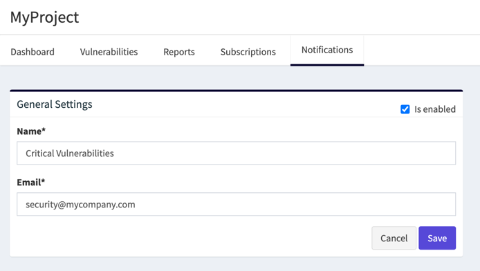
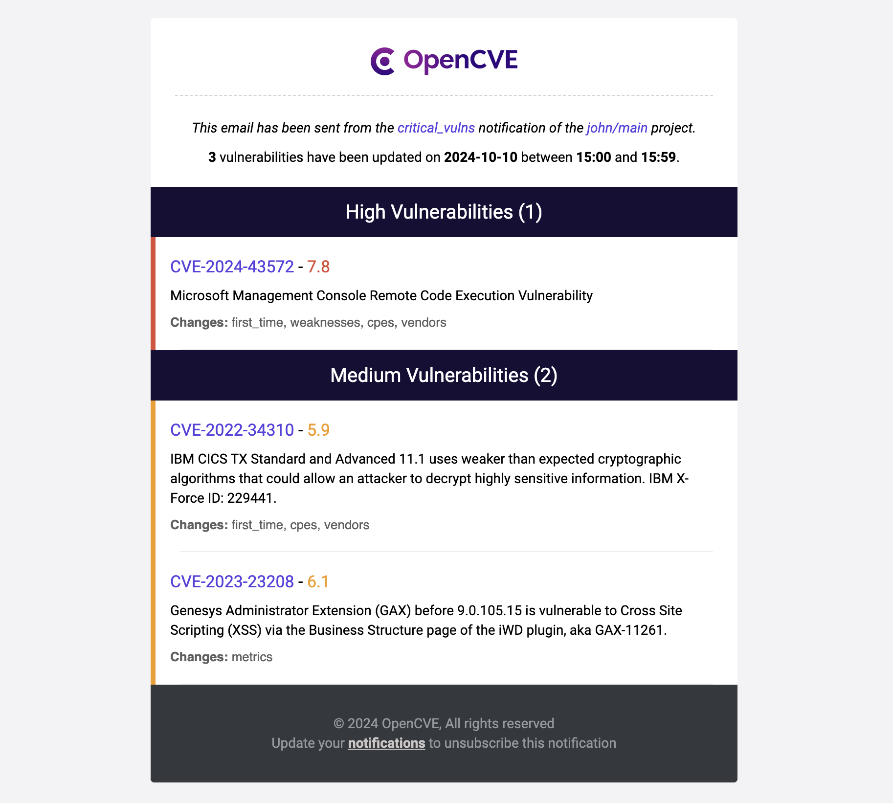

# Notifications

## Overview

Notifications are set at the project level within an organization.

When a CVE is added or updated, OpenCVE reviews its associated CPEs (Common Platform Enumeration) and extracts a list of vendors and their associated products.

OpenCVE then checks each project that has subscribed to these vendors and products and sends notifications accordingly.

A project can have zero or multiple notifications.

{.center style="width:100%"}

## Notification Filters

When a notification is created within a project, the user can choose to filter CVEs based on different criteria.

For example, the user may choose to trigger a notification only if the CVSS 3.1 score is equal to or greater than a certain value (additional scoring options will be added in future OpenCVE releases).

The user can also decide to be notified based on the type of modification: whether it's a change in references, CPEs, CWEs, etc.

This allows users to receive notifications only for the changes that matter to them. Furthermore, they can configure one notification to send high-severity CVEs to a channel that is closely monitored, while sending all other notifications to a less-watched channel.

{.center style="width:100%"}

## Notification Types

!!! info
    We are currently working on adding more types of notifications. The next one planned, for example, will be Slack.

    Feel free to open an issue on our [GitHub](https://github.com/opencve/opencve) for specific needs (check existing issues before creating a new one).

### Email

This is the simplest type of notification. When a change is detected, an email is sent to the address configured in the settings.

{.center style="width:70%"}

Here is an example:

{.center style="width:100%"}

### Webhook

Webhook notifications allow users to interface with their own information systems or tools, such as an ITSM service.

When a change is detected, a POST request is sent to the URL defined in the configuration. The user can also add custom headers if required by their system.

{.center style="width:75%"}

<details><summary>Click to show a payload example</summary>

```json
{
  "organization": "myorga",
  "project": "myproject",
  "notification": "mynotification",
  "period": {
    "start": "2024-09-16T07:00:00+00:00",
    "end": "2024-09-16T07:59:59+00:00"
  },
  "changes": [
    {
      "cve": {
        "cve_id": "CVE-2024-6789",
        "description": "A path traversal issue in API endpoint in M-Files Server before version 24.8.13981.0 and LTS 24.2.13421.15 SR2 and LTS 23.8.12892.0 SR6 allows authenticated user to read files",
        "cvss31": 6.5
      },
      "events": [
        {
          "details": {
            "new": "A path traversal issue in API endpoint in M-Files Server before version 24.8.13981.0 allows authenticated user to read files",
            "old": null
          },
          "type": "description"
        },
        {
          "details": {
            "new": "Path traversal in M-Files API",
            "old": null
          },
          "type": "title"
        },
        {
          "details": {
            "added": [
              "CWE-22"
            ],
            "removed": []
          },
          "type": "weaknesses"
        },
        {
          "details": {
            "added": [
              "https://product.m-files.com/security-advisories/cve-2024-6789/"
            ],
            "removed": []
          },
          "type": "references"
        },
        {
          "details": {
            "added": {
              "cvssV4_0": {
                "score": 8.4,
                "vector": "CVSS:4.0/AV:N/AC:L/AT:N/PR:L/UI:N/VC:H/VI:N/VA:N/SC:H/SI:H/SA:N/RE:M/U:Green"
              }
            },
            "removed": {},
            "updated": {}
          },
          "type": "metrics"
        }
      ]
    }
  ]
}
```
</details>

The format of the JSON is the following one:

```json
{
  "organization": "the-organization-name",
  "project": "the-project-name",
  "notification": "the-notification-name",
  "period": {
    "start": "2024-01-01T00:00:00+00:00",
    "end": "2024-01-01T00:59:59+00:00"
  },
  "changes": [
    {
      "cve": {
        "cve_id": "CVE-2024-0001",
        "description": "The CVE description",
        "cvss31": 10.0
      },
      "events": [...]
    }
  ]
}
```

As you can see a webhook payload can have multiple CVE changes during the same period, and for each CVE multiple events could have occurred (the title changed, a new metric was added...).

The list of events (`description`, `metrics`, `references`...) is given in a table in the [Knowledge Base (KB)](kb.md#cve-changes) documentation.
