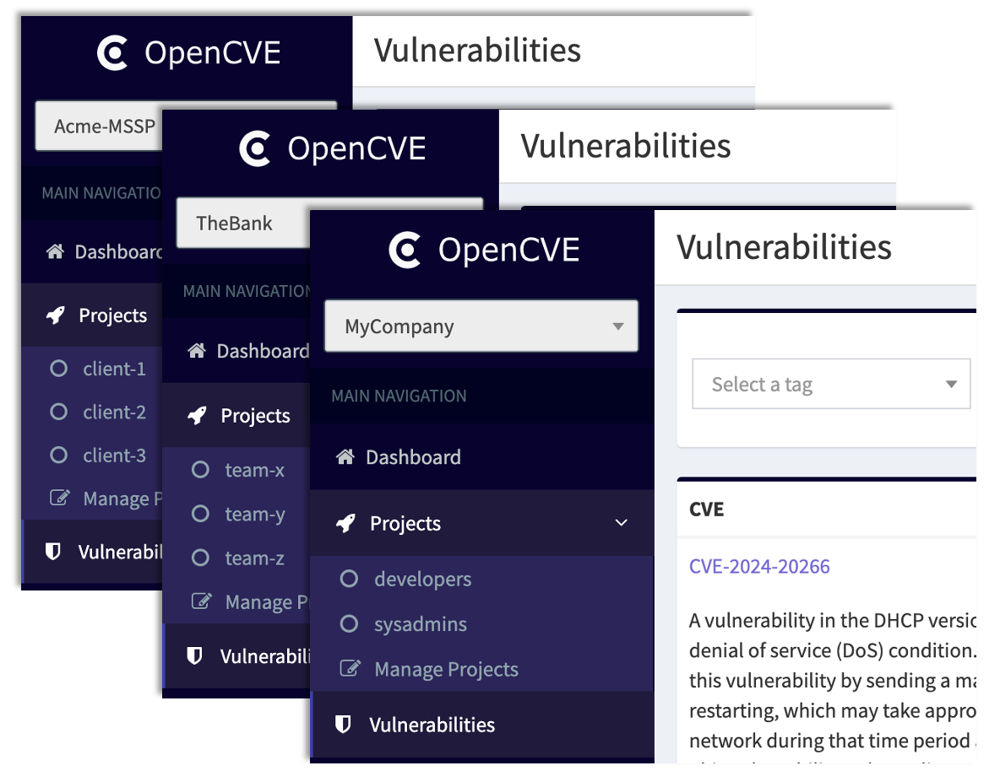
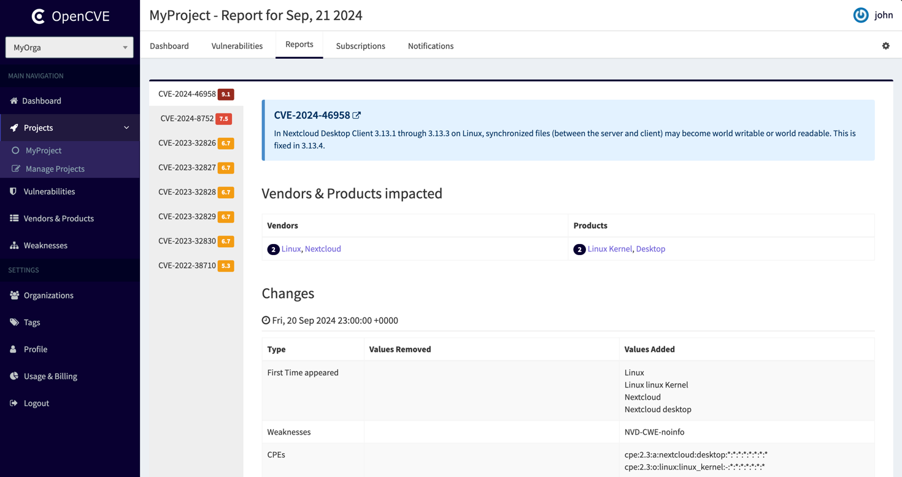

# Organizations & Projects

## Organizations

In OpenCVE, an **Organization** is the highest-level object. Without an organization, a user cannot subscribe to products or vendors, nor receive notifications when a CVE appears or is updated.

Each user can belong to one or more organizations, with one of the following two roles:

- **Member**, who can manage subscriptions (vendors and products).
- **Owner**, who has full control over the organization, including managing memberships.

{.center style="width:90%"}

## Projects

An organization can have one or more **Projects**.

Projects allow organizations to organize their subscriptions and [notifications](notifications.md) in a way that suits their structure and needs. Here are a few common use cases for projects:

- An **MSSP (Managed Security Service Provider)** might create a project for each of their clients (e.g., client1, client2, client3).
- An **IT Companies** might create projects based on technical teams (e.g., team-X, team-Y, team-Z).
- A **smaller organization** could split projects by roles within the company, for instance, having one project for developers and another for sysadmins.

{.center style="width:70%"}

Each project operates independently and has its own dashboard to track the evolution of vulnerabilities in its subscriptions.

### Notifications

A project can also have one or more **notifications**. Whenever a CVE appears, or when an existing CVE is updated, and if this CVE is associated to one of your subscription, a notification is sent through the designated channel.

{.center style="width:90%"}

This flexibility allows users to be alerted through different channels (e.g., email, webhook) based on custom filters, for instance:

- all the changes are sent to an API using the webhook notification,
- and a mail is also sent on a mailing-list for all the CVEs with a CVSS score >= 9.

!!! note
    OpenCVE supports for now 2 types of notifications: `email` and `webhook`. Others are planned for future releases, such as `slack` or `opsgenie` ones.

### Reports

Projects include a **Report** tab, which provides a daily summary of the activity related to a project's subscriptions:

{.center style="width:90%"}

This feature helps users stay informed about what happened with their subscriptions on a day-to-day basis.

!!! info
    Reports differ from notifications: notifications alert you in real-time when a CVE is updated, but only if it matches your filters.
    In contrast, daily reports include all CVE changes related to any product or vendor in your subscriptions, providing a broader overview of activity.
